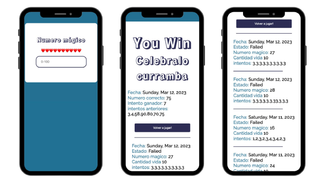
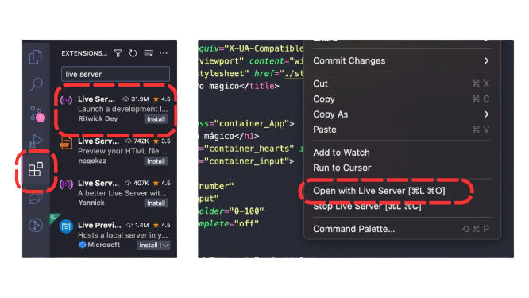

##Numero Magico

## Descargar

[Download ZIP](https://github.com/Juan7diaz/MagicNumber-game/archive/refs/heads/main.zip)

or

`git clone https://github.com/Juan7diaz/MagicNumber-game.git
`

##Instalación

**Nota:** Como se implementó modulos (`import/export`) si deseas descargar la app y ejecutarla localmente, deberás ejecutarlos a través de un servidor web local. (*puedes utilizar Live Server*)

1. Live Server - Extensión de VSCODE

> Extensiones > Live Server > Install > Clic derecho dentro del index.html > Open with Live Server

Ahora puedes visitar [http://127.0.0.1:5500/index.html](http://127.0.0.1:5500/index.html) or [http://localhost:5500/](http://localhost:5500/)